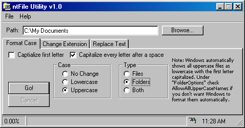



## Filename Utility

### Description

This real time-saving program lets you format filenames to your liking. Don't you get really annoyed when you download your favorite MP3 music and there are those _'s in place of every SPACE, wish you could get rid of them out of your hundred of files??? Now YOU CAN! It will replace or remove characters from filenames, it format its CASE and will change file extensions. Get it today!!
 
### More Info
 

             |
---                |---
**Submitted On**   |2000-03-22 09:25:52
**By**             |[Shannon Little](https://github.com/Planet-Source-Code/PSCIndex/blob/master/ByAuthor/shannon-little.md)
**Level**          |Advanced
**User Rating**    |5.0 (10 globes from 2 users)
**Compatibility**  |VB 5\.0, VB 6\.0
**Category**       |[Complete Applications](https://github.com/Planet-Source-Code/PSCIndex/blob/master/ByCategory/complete-applications__1-27.md)
**World**          |[Visual Basic](https://github.com/Planet-Source-Code/PSCIndex/blob/master/ByWorld/visual-basic.md)
**Archive File**   |[CODE\_UPLOAD41313222000\.zip](https://github.com/Planet-Source-Code/shannon-little-filename-utility__1-6750/archive/master.zip)

